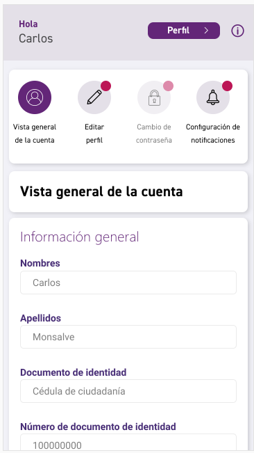

## Development server
Run ng serve for a dev server. Navigate to http://localhost:4200/. The app will automatically reload if you change any of the source files.

## Depuere

rm -r node_modules
rm -r package-lock.json
npm cache clear --force
npm cache verify
npm i
ng serve -o

